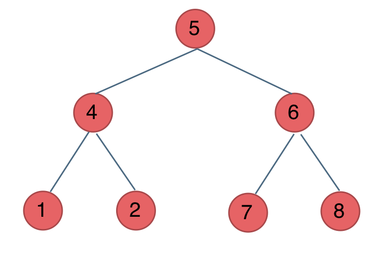

# 树

## 树的特别注意

1. 注意对第一个node的条件判断！注意对第一个node的条件判断！注意对第一个node的条件判断！

## 树的相关知识

### 0. 树的遍历框架

二叉树遍历框架，典型的非线性递归遍历结构：(来源：labladong)

```
/* 基本的二叉树节点 */
class TreeNode {
    int val;
    TreeNode left, right;
}

void traverse(TreeNode root) {
    traverse(root.left)
    traverse(root.right)
}

/* 基本的 N 叉树节点 */
class TreeNode {
    int val;
    TreeNode[] children;
}

void traverse(TreeNode root) {
    for (TreeNode child : root.children)
        traverse(child)
}

```


### 1. 前中后序遍历

树的四种遍历(来源：代码随想录)

关键是中的位置。中的位置即为顺序。

前序遍历（中左右）：5 4 1 2 6 7 8  
中序遍历（左中右）：1 4 2 5 7 6 8  
后序遍历（左右中）：1 2 4 7 8 6 5  

### 2. 树的思维方法


1. 正常的recursion和遍历

2. 迭代

3. 序列化，反序列化（结构唯一性问题）


```
先序遍历（深度优先搜索）
中序遍历（深度优先搜索）（尤其二叉搜索树）
后序遍历（深度优先搜索）
层序遍历（广度优先搜索）
序列化与反序列化（结构唯一性问题）
```


### 3. 技巧

1.中序遍历二叉搜索树得到的是有序结点;


### 应该干掉的题目

https://leetcode-cn.com/problems/find-duplicate-subtrees/submissions/


## 树的相关题集

### 94. Binary Tree Inorder Traversal <b>Difficulty: Normal</b>

正常的递归解法：  

非常简单，只要可以
```
/**
 * Definition for a binary tree node.
 * public class TreeNode {
 *     int val;
 *     TreeNode left;
 *     TreeNode right;
 *     TreeNode(int x) { val = x; }
 * }
 */
class Solution {
	public List<Integer> inorderTraversal(TreeNode root) {
		List<Integer> res = new ArrayList<Integer>();
		dfs(res,root);
		return res;
	}
	
	void dfs(List<Integer> res, TreeNode root) {
		if(root==null) {
			return;
		}
		//按照 左-打印-右的方式遍历
		dfs(res,root.left);
		res.add(root.val);
		dfs(res,root.right);
	}
}

作者：wang_ni_ma
链接：https://leetcode-cn.com/problems/binary-tree-inorder-traversal/solution/dong-hua-yan-shi-94-er-cha-shu-de-zhong-xu-bian-li/
来源：力扣（LeetCode）
著作权归作者所有。商业转载请联系作者获得授权，非商业转载请注明出处。

```